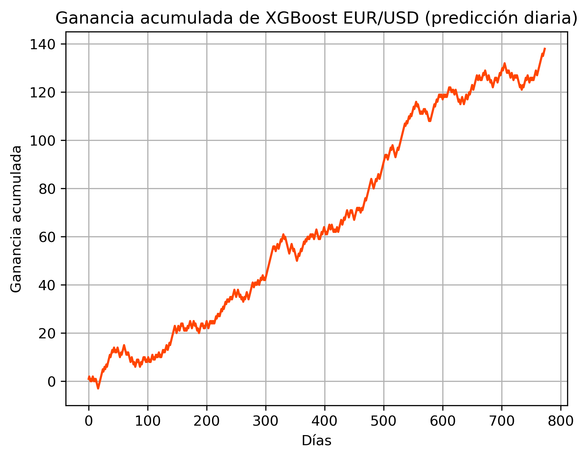

# Forex Predict ML


Proyecto de prediccion direccional para mercados financieros (EURUSD, COPUSD y NASDAQ) usando Python, Jupyter Notebook, yfinance, ta, scikit-learn y XGBoost, con el objetivo de construir y evaluar modelos de clasificacion para horizontes de 1 dia, 1 semana y 1 mes.

## Objetivo

Construir y evaluar modelos de clasificacion para predecir direccion de precio en diferentes horizontes (1 dia, 1 semana, 1 mes), con:

- Feature engineering tecnico (retornos, medias, volatilidad, momentum, RSI, Williams %R, Bollinger %B, MACD).
- Evaluacion con split temporal.
- Prueba estadistica contra coinflip (binomial test).

## Estructura Del Proyecto

- notebooks/ForexPredictML.ipynb: notebook principal con exploracion, tuning y visualizaciones.
- src/forex_predict_clean.py: pipeline en script para ejecucion reproducible.
- docs/project_notes.md: notas de evolucion y plan tecnico.
- docs/figures/: carpeta para capturas de resultados.
- requirements.txt: dependencias Python.
- LICENSE: licencia MIT.

## Instalacion

```bash
python -m venv .venv
source .venv/bin/activate
pip install -r requirements.txt
```

## Ejecucion

### Notebook interactivo

```bash
jupyter notebook notebooks/ForexPredictML.ipynb
```

### Pipeline reproducible

```bash
python src/forex_predict_clean.py
```

## Metodologia

1. Descarga de datos con yfinance.
2. Creacion de variables tecnicas.
3. Tuning con separacion temporal train/valid/test.
4. Seleccion de hiperparametros por validacion.
5. Evaluacion final en holdout y prueba binomial.

## Snapshot De Resultados

En una corrida reciente del bloque diario (EURUSD):

- Mejor configuracion por validacion: alpha 805, rsi_window 4, willr_window 7, bb_window 7.
- Accuracy final en test del entrenamiento posterior: 0.624.

Nota: estos valores pueden variar por periodo de datos y cambios del notebook.

## Visualizaciones



## Roadmap

- Implementar walk-forward validation.
- Exportar metricas a CSV/JSON en una carpeta de resultados.
- Agregar pruebas unitarias para feature engineering.
- Crear un CLI para elegir simbolo y horizonte.